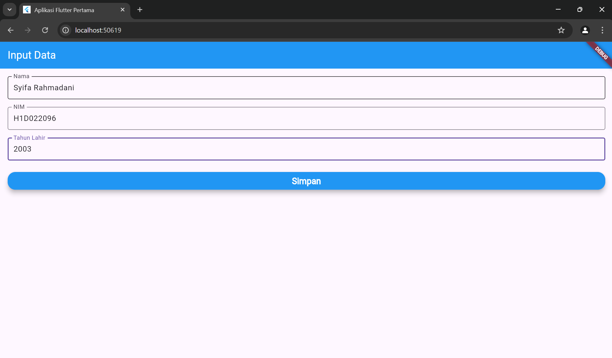

# Tugas Pertemuan 2

Buatlah tampilan form yang berisi nama, nim, dan tahun lahir pada file `ui/form_data.dart`, lalu buatlah tampilan hasil dari input data tersebut pada file `ui/tampil_data.dart`
(ada di image formSyifa.png dan hasilSyifa.png)

JELASKAN PROSES PASSING DATA DARI FORM MENUJU TAMPILAN DENGAN FILE `README.md`:
Passing data dari form menuju tampilan diproses dengan mengambil input pengguna dari nama, NIM, dan tahun lahir yang diakses dengan controller. Ketika button simpan di-click, data yang diinputkan pada textfield diambil dari controller dan diparsing menjadi tipe data yahng sesuai. Tipe data Nama dan NIM adalah String, sedangkan tahun lahir int. Selanjutnya, data tersebut diteruskan ke halaman tampil_data.dart melalui konstruktor saat navigasi dilakukan menggunakan Navigator.of(context).push. Di halaman tampil_data.dart, data yang diterima ditampilkan dalam bentuk teks dan umur dihitung berdasarkan tahun lahir yang diterima.

Buat tampilan semenarik mungkin untuk dilihat.

Nama : Syifa Rahmadani Hemi Syafitri

NIM : H1D022096

Shift Baru: D

## Screenshot

